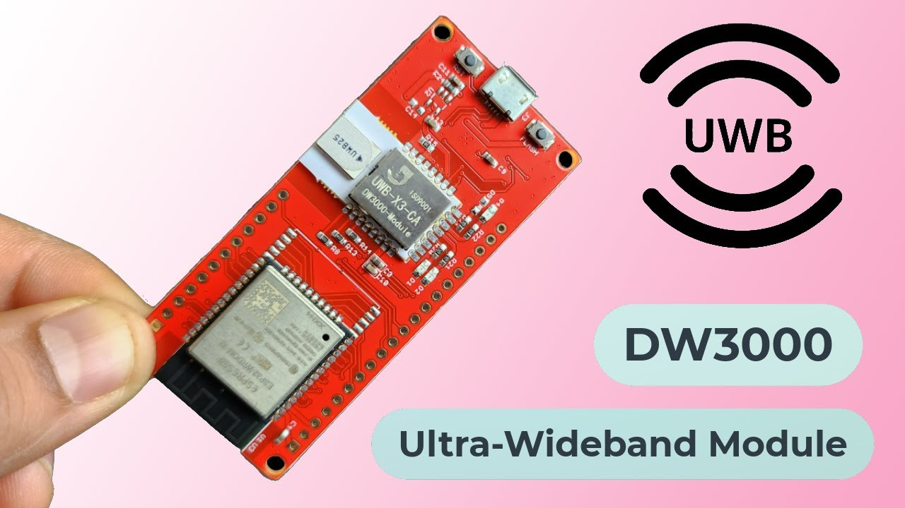
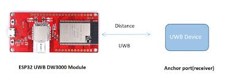
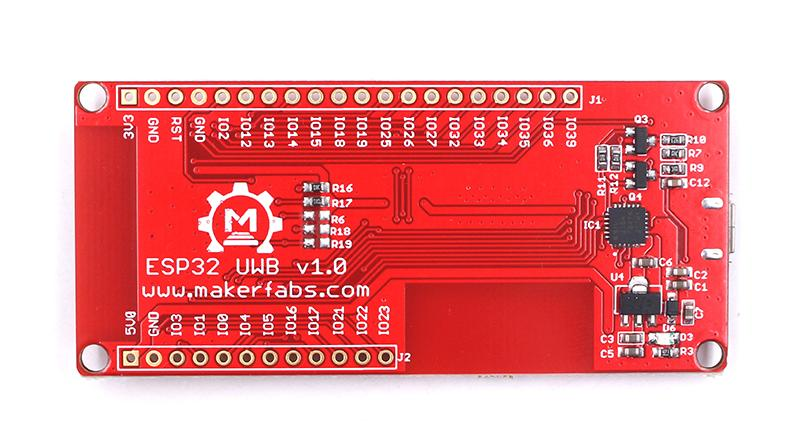
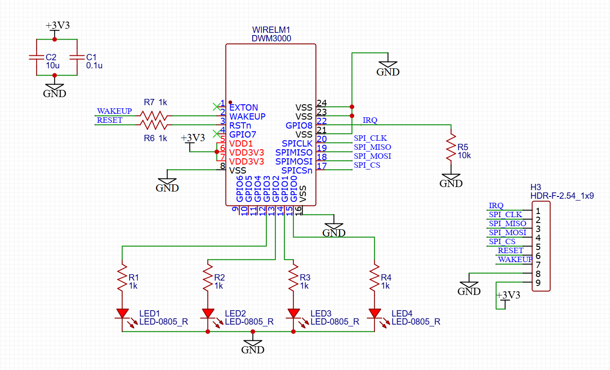

# UWB-DW3000-System

`UWB-DW3000-System` is an `ESP-IDF` firmware project for `ESP32 + DW3000` UWB boards.

The project is intended as a clean and scalable starting point for building a practical UWB system, beginning with low-level board bring-up and two-board communication, then extending toward anchor/tag ranging, multi-anchor positioning, and host-side integration.

## Overview

This codebase targets UWB hardware built around:
- `ESP32` as the main MCU
- `DW3000` as the UWB transceiver
- onboard SPI / GPIO / IRQ connections for radio control

The immediate goal of the project is to support a practical two-board setup:
- one board running as `anchor`
- one board running as `tag`
- one shared codebase with role-specific behavior separated cleanly

## DW3000 Advantages

Compared with the `DWM1000` generation, `DW3000` offers several advantages for a newer UWB firmware platform:

1. Interoperability direction with the Apple `U1` ecosystem is one of the main reasons people consider the `DW3000` family for newer applications.
Note: this capability is described by Qorvo for the DW3000 family, but this project does not currently include related files or demos for that workflow.
2. Better alignment with `FiRa` PHY, MAC, and certification-oriented development, which makes it more suitable for further system expansion.
3. Lower power consumption than the older `DWM1000` generation.
4. Support for UWB `Channel 5` (`6.5 GHz`) and `Channel 9` (`8 GHz`), while the older `DWM1000` generation does not support Channel 9.

## Design Goals

The project is organized around a few engineering goals:
- keep hardware-specific code isolated from application logic
- make `DW3000` bring-up easy to debug
- separate board, HAL, driver, ranging, and role layers
- keep logging controllable at module/function level
- allow gradual growth from two-board tests to a larger UWB system

Current pin mapping in the project:
- `SPI_SCK`  = `GPIO18`
- `SPI_MOSI` = `GPIO23`
- `SPI_MISO` = `GPIO19`
- `UWB_CS`   = `GPIO4`
- `UWB_RST`  = `GPIO27`
- `UWB_IRQ`  = `GPIO34`
- `STATUS_LED` = `GPIO2`

## Project Structure

## Reference

- UWB board product page: https://www.makerfabs.com/esp32-uwb-dw3000.html
- UWB wiki / related repository entry: http://github.com/Makerfabs/Makerfabs-ESP32-UWB
- Hardware and software reference repository: https://github.com/Makerfabs/Makerfabs-ESP32-UWB
- `ESP32-WROOM-32` datasheet: [docs/esp32-wroom-32_datasheet_en.pdf](docs/esp32-wroom-32_datasheet_en.pdf)
- `DW3110 / DW3000 family` reference page: https://www.qorvo.com/products/p/DW3110#overview
